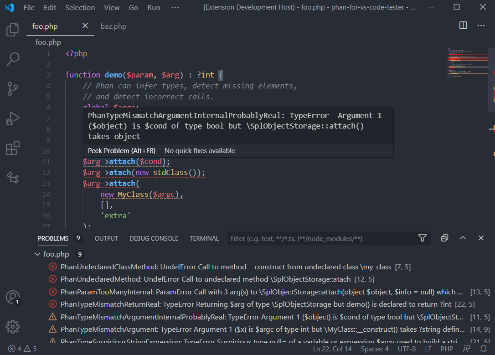

# Phan for VSCode (Beta)

Simple [Phan](https://github.com/phan/phan) integration for Visual Studio Code. With this extension you can perform static code analysis to PHP scripts and detect common (and no so common) mistakes on-the-fly.

**NOTE:** this is a beta version. If you find a bug please create an issue on GitHub :)



## Features

* **Easy configuration**: Only a valid Phan executable path is required to get the extension working.
* **Workspace based**: Use Phan in a per-workspace basis. 
* **Editor integration**: All issues are listed in the `Problems` panel. Also, the issues are highlighted in the code editor, with detailed information at hover.

## Requirements

Phan binary must be installed globally in your operating system. You can get last Phan version with [Composer](https://getcomposer.org) by running:

```
composer global require "phan/phan:4.x"
```

 Aditional PHP configuration may be required, (including the installation of `php-ast` extension) Please follow the [Phan dependencies installation instructions](https://github.com/phan/phan/wiki/Getting-Started#installing-dependencies).
 
## Extension Settings


* `vsphan.phanPath`: Absolute path to Phan binary. For Windows, use the `phan.bat` file.

## Known Issues

* Not yet tested on Unix-based operating systems. All feedback are appreciated.

## Release Notes

### 1.0.0

Initial release of Phan for VSCode
